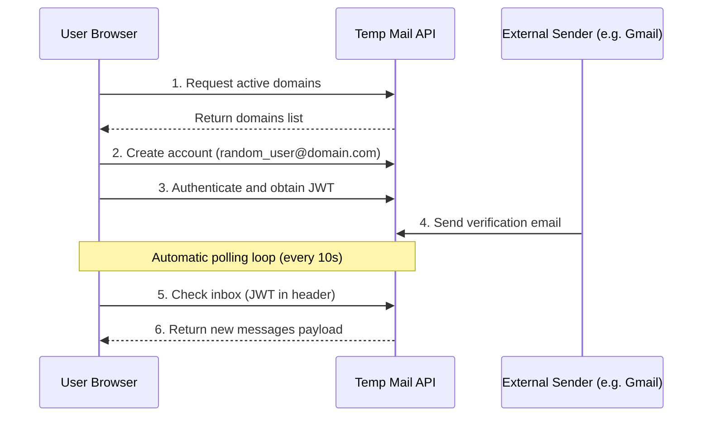

In the modern digital landscape, email addresses are treated as digital currencies. Almost every web service, blog, e-commerce platform, and download portal demands your email address before granting access. You can generate a private burner inbox instantly using our [Temp Mail Generator](/temp-mail/).

While this seems harmless, it comes with a hidden cost: **your digital privacy**. Once a platform obtains your primary email, you are instantly added to marketing queues, newsletter lists, and data-broker databases. More critically, if that company suffers a data breach, your email address—and potentially your associated passwords—will end up on the dark web.

This is where **Temp Mail (Disposable Email)** comes in. In this guide, we will explore how burner emails work, why they are essential for your online security, and how to use them effectively without compromising your accounts.

---

## What is Temp Mail (Disposable Email)?

A temporary, disposable, or "burner" email is a short-lived email address generated automatically for a specific, single-use purpose. Unlike your permanent email (like Gmail, Outlook, or iCloud), a temp mail address requires no signup forms, passwords, or personal details. 

You simply generate an address in one click, copy it, complete your verification or file download, read the incoming email directly in your browser, and walk away. The address will expire automatically, leaving your primary inbox completely spam-free.

---

## Why You Need a Burner Email Today

### 1. Stopping Spam and Newsletters at the Source
Many sites force you to register just to read a single article, download a PDF, or look at a price. By using a temporary address, you get the resource you need, and any future promotional spam sent to that address goes straight into a digital void.

### 2. Protecting Against Data Leaks and Phishing
Hackers frequently target small, poorly secured websites to steal their user databases. If you use your real email address across dozens of minor sites, your email becomes exposed. A burner email keeps your primary address isolated from these security vulnerabilities.

### 3. Evading Third-Party Trackers
Marketing agencies use email hashes as universal identifiers to track your activity across different platforms. Using a unique temporary email blocks these ad networks from linking your web activities to your real profile.

---

## How Temp Mail Works Under the Hood

Modern temp mail tools (like our built-in [Temp Mail Generator](https://webutilbox.com/temp-mail/)) leverage open APIs (such as Mail.tm) directly from the browser context to deliver instantaneous inboxes. 

Here is the general engineering workflow:

---

## Client-Side Security: The Role of Sandboxing

One of the biggest security risks when displaying emails is **Cross-Site Scripting (XSS)** and tracking pixel exploits. If an incoming email contains malicious JavaScript, it could attempt to read your browser cookies or localStorage credentials.

To prevent this, our Temp Mail reader utilizes HTML5 **`iframe` sandboxing**:

1. **Isolation:** Incoming HTML body payloads are rendered inside a strict `<iframe sandbox="allow-popups allow-popups-to-escape-sandbox">`.
2. **Origin Blocking:** By omitting the `allow-same-origin` token, the browser treats the email content as a completely separate, unique origin. It cannot access the parent page's variables, cookies, or cookies of the active host.
3. **Script Disabling:** By omitting the `allow-scripts` token, any scripts embedded in the email markup are blocked by the browser engine from executing.

---

## When to Avoid Using Temp Mail

While burner emails are perfect for privacy, you should **never** use them for primary or high-importance accounts:
* **Banking and Finance:** You must use a secure, permanent address for recovery.
* **Primary Social Media:** If you lose your password, you will lock yourself out permanently.
* **Government & Professional profiles:** Requires verification integrity.

Use temporary email addresses exclusively for **throwaway signups, unverified forums, one-time coupon codes, and minor app testing.**

---

### Start Protecting Your Inbox
Ready to guard your personal email? Use our free, 100% private [Temp Mail Generator](/temp-mail/) to create a secure inbox instantly right in your browser.
